**SENG 637 - Dependability and Reliability of Software Systems**

**Lab. Report #3 – Code Coverage, Adequacy Criteria and Test Case Correlation**

| Group \#:      | 21 |
|----------------|----|
| Student Names: |    |
| Carrie         |    |
| Jon            |    |
| Paolo          |    |
| Israel         |    |
| Henry          |    |

(Note that some labs require individual reports while others require one report
for each group. Please see each lab document for details.)

# 1 Introduction

The purpose of this lab is to extend the previous lab, and demonstrate white box testing and code coverage tools. The
code coverage tool will be used to measure the adequacy of the test suite created in the previous lab, and additional
tests will be added using white box testing to reach certain coverage goals. These goals should be reached for the 10
methods that were tested in the previous lab.

The chosen coverage tool is EclEmma, and the coverage metric goals are as follows:

- 90% Statement/line coverage
- 70% Branch coverage
- 60% Instruction coverage

Note that the initial goal of condition coverage was replaced with instruction coverage, since EclEmma does not have
support for condition coverage. (see decision details in Section 6)

# 2 Manual data-flow coverage calculations

## Range.combine

+ **data flow graph**

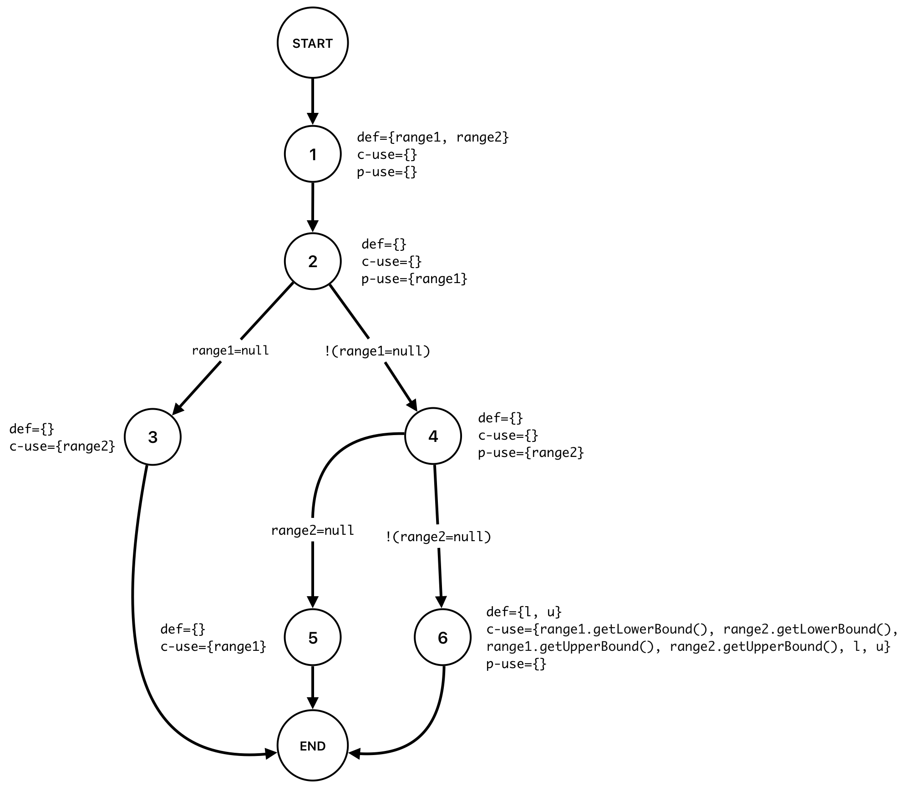

+ **def-use sets per statement**

> Note: Due to the current context, we treat "statement" as a node in the graph, which is consistent with data flow
> analysis principles.

|       | Values                                                                                                          |
|-------|-----------------------------------------------------------------------------------------------------------------|
| defs: | def(1) = {range1, range2}                                                                                       |
|       | def(6) = {l, u}                                                                                                 |
| uses: | use(2) = {range1}                                                                                               | 
|       | use(3) = {range2}                                                                                               |
|       | use(4) = {range2}                                                                                               |
|       | use(5) = {range1}                                                                                               |
|       | use(6) = {range1.getLowerBound(), range2.getLowerBound(), range1.getUpperBound(), range2.getUpperBound(), l, u} |

+ **list of all DU-pairs per variable**

| Variable                          | DU-pairs               |
|-----------------------------------|------------------------|
| for range1                        | (1, 2), (1, 5), (1, 6) |
| for range2                        | (1, 3), (1, 4), (1, 6) |
| for l                             | (6, 6)                 |
| for u                             | (6, 6)                 |
| total number of feasible DU-pairs | 6                      |

+ **pairs covered for each test case by tracing through the execution**

DU-pair coverage = (number of exercised DU pairs) / (total number of feasible DU pairs) = (number of exercised DU
pairs) / (total number of DU pairs - total number of infeasible DU pairs)

| Test case                    | Inputs (range1, range2)          | Execution path | DU-pairs covered                               | DU-pair coverage percent |
|------------------------------|----------------------------------|----------------|------------------------------------------------|--------------------------|
| combineWithBothRangesNotNull | range1 = (1, 3), range2 = (2, 4) | 1, 2, 4, 6     | (1, 2), (1, 4), (1, 6), (6, 6)                 | 4 / 6 * 100% = 66.66%    |
| combineWithFirstRangeNull    | range1 = null, range2 = (2, 4)   | 1, 2, 3        | (1, 2), (1, 3)                                 | 2 / 6 * 100% = 33.33%    |
| combineWithSecondRangeNull   | range1 = (1, 3), range2 = null   | 1, 2, 4, 5     | (1, 2), (1, 4), (1, 5)                         | 4 / 6 * 100% = 66.66%    |
| combineWithBothRangesNull    | range1 = null, range2 = null     | 1, 2, 3        | (1, 2), (1, 3)                                 | 2 / 6 * 100% = 33.33%    |
| All                          |                                  |                | (1, 2), (1, 3), (1, 4), (1, 5), (1, 6), (6, 6) | __6 / 6 * 100% = 100%__  |

> All DU-pair coverage of 100%

## DataUtilities.calculateColumnTotal

+ **data flow graph**

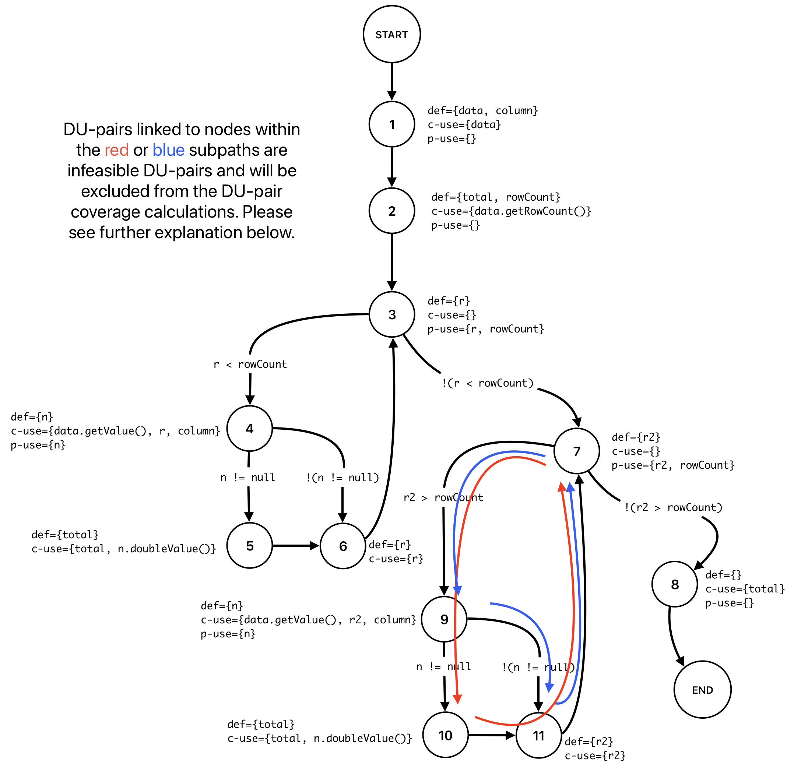

> Note: The code inside the second for loop in DataUtilities.calculateColumnTotal method will never be executed in real conditions.
>
> 1. In a real condition the rowCount variable can only be positive or zero and since r2 is initialized to 0, the condition r2 > rowCount will never be true.
> 2. However when mocking you can create an artifical (fake) conditon were data.getRowCount() returns a negative value, however this do not represent
> a real scenario and will be ignored. Mocking should aim to simulate plausible conditions under which the software operates to ensure that tests
> are meaningful and reflect potential real-world usage.
>
> DU-pairs linked to nodes 9, 10 and 11 are infeasible. Infeasible DU-pairs should not be considered when calculating coverage metrics in a data flow graph, 
> because they represent scenarios that cannot occur during any program execution, regardless of the input. 
> Including them would lead to misleading, unrealistic, and unachievable testing goals, diverting resources and attention 
> from testing feasible, meaningful DU-pairs that accurately reflect the software's behavior.
>
>

+ **def-use sets per statement**

> Note: Due to the current context, we treat "statement" as a node in the graph, which is consistent with data flow
> analysis principles.

|       | Values                                   |
|-------|------------------------------------------|
| defs: | def(1) = {data, column}                  |
|       | def(2) = {total, rowCount}               |
|       | def(3) = {r}                             |
|       | def(4) = {n}                             |
|       | def(5) = {total}                         |
|       | def(6) = {r}                             |
|       | def(7) = {r2}                            |
| uses: | use(1) = {data}                          | 
|       | use(2) = {data.getRowCount()}            |
|       | use(3) = {r, rowCount}                   |
|       | use(4) = {data.getValue(), r, column, n} |
|       | use(5) = {total, n.doubleValue()}        |
|       | use(6) = {r}                             |
|       | use(7) = {r2, rowCount}                  |
|       | use(8) = {total}                         |

+ **list of all DU-pairs per variable**

| Variable                          | DU-pairs                                       |
|-----------------------------------|------------------------------------------------|
| for data                          | (1, 1), (1, 2), (1, 4)                         |
| for column                        | (1, 4)                                         |
| for total                         | (2, 5), (2, 8), (5,5), (5, 8)                  |
| for rowCount                      | (2, 3), (2, 7)                                 |
| for r                             | (3, 3), (3, 4), (3, 6), (6, 3), (6, 4), (6, 6) |
| for n                             | (4, 4), (4, 5)                                 |
| for r2                            | (7, 7)                                         |
| total number of feasible DU-pairs | 18                                             |

+ **pairs covered for each test case by tracing through the execution**

DU-pair coverage = (number of exercised DU pairs) / (total number of feasible DU pairs) = (number of exercised DU
pairs) / (total number of DU pairs - total number of infeasible DU pairs)

| Test case                                      | Execution path                 | DU-pairs covered                                                                                                                              | DU-pair coverage percent |
|------------------------------------------------|--------------------------------|-----------------------------------------------------------------------------------------------------------------------------------------------|--------------------------|
| calculateColumnTotalForTwoValues               | 1, 2, 3, 4, 5, 6, 3, ..., 7, 8 | (1, 1), (1, 2), (2, 3), (3, 3) (1, 4), (3, 4), (2, 5), (4, 4), (4, 5), (5, 5), (3, 6), (6, 3), (6, 4), (6, 6), (2, 7), (7, 7), (5, 8)         | 17 / 18 * 100 = 94.44%   |
| calculateColumnTotalForTwoNegValues            | 1, 2, 3, 4, 5, 6, 3, ..., 7, 8 | (1, 1), (1, 2), (2, 3), (3, 3) (1, 4), (3, 4), (2, 5), (4, 4), (4, 5), (5, 5), (3, 6), (6, 3), (6, 4), (6, 6), (2, 7), (7, 7), (5, 8)         | 17 / 18 * 100 = 94.44%   |
| calculateColumnTotalForTwoOppositeSignedValues | 1, 2, 3, 4, 5, 6, 3, ..., 7, 8 | (1, 1), (1, 2), (2, 3), (3, 3) (1, 4), (3, 4), (2, 5), (4, 4), (4, 5), (5, 5), (3, 6), (6, 3), (6, 4), (6, 6), (2, 7), (7, 7), (5, 8)         | 17 / 18 * 100 = 94.44%   |
| calculateColumnTotalForTwoZeros                | 1, 2, 3, 4, 5, 6, 3, ..., 7, 8 | (1, 1), (1, 2), (2, 3), (3, 3) (1, 4), (3, 4), (2, 5), (4, 4), (4, 5), (5, 5), (3, 6), (6, 3), (6, 4), (6, 6), (2, 7), (7, 7), (5, 8)         | 17 / 18 * 100 = 94.44%   |
| calculateColumnTotalForNulls1                  | 1, 2, 3, 4, 6, 3, ..., 7, 8    | (1, 1), (1, 2), (2, 3), (3, 3) (1, 4), (3, 4), (4, 4), (3, 6), (6, 3), (6, 4), (6, 6), (2, 7), (7, 7), (2, 8)                                 | 14 / 18 * 100 = 77.77%   |
| All                                            |                                | (1, 1), (1, 2), (2, 3), (3, 3) (1, 4), (3, 4), (2, 5), (4, 4), (4, 5), (5, 5), (3, 6), (6, 3), (6, 4), (6, 6), (2, 7), (7, 7), (2, 8), (5, 8) | 18 / 18 * 100 = 100%     |

> All DU-pair coverage of 100%

# 3 A detailed description of the testing strategy for the new unit test

The first step in reaching the given coverage goal is to find the current coverage of the test suite.

One interesting thing to note is that EclEmma does not seem to work with JMock objects, so any mock objects were
replaced with "real" ones prior to determining the initial state of coverage. Specifically, DefaultKeyedValues2D and
DefaultKeyedValues objects were used in DataUtilitiesTest.java.

Using EclEmma, the current coverage for the 10 methods can be shown below.

## Statement (line) coverage

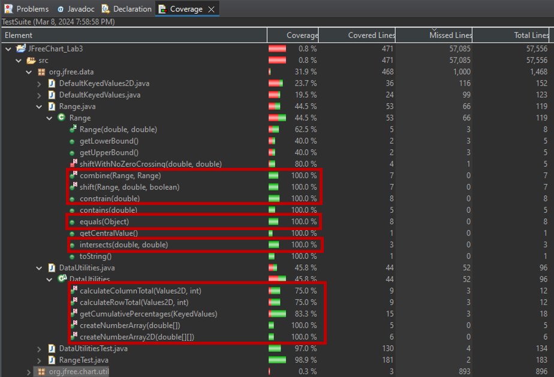

## Branch coverage

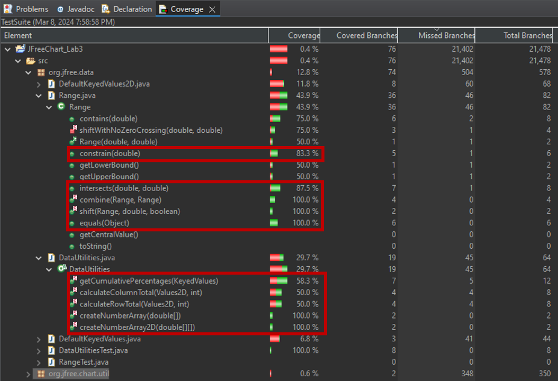

## Instruction coverage

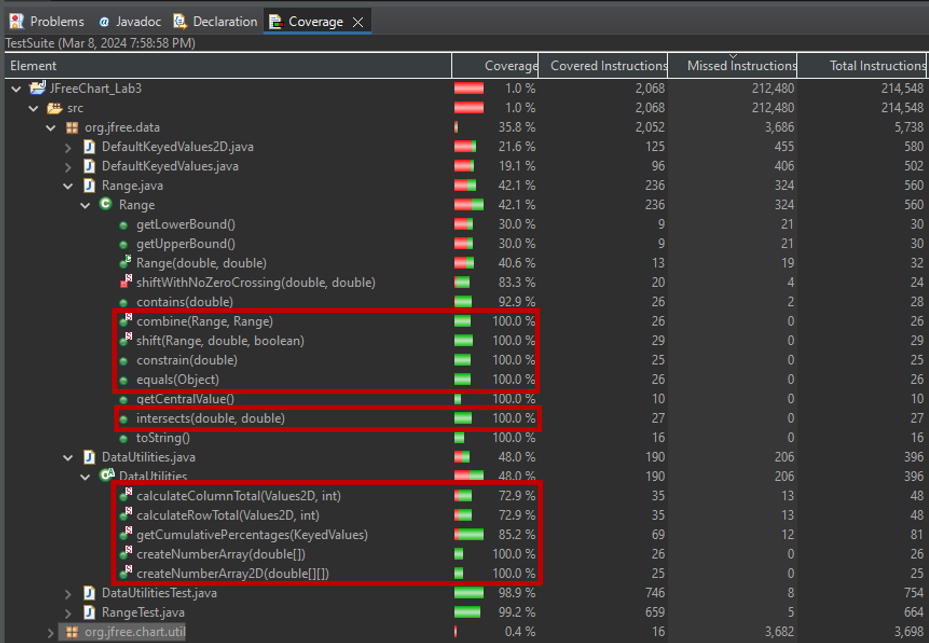

Once the initial state of coverage was determined, EclEmma was used to further increase coverage. This process was quite
straight forward because EclEmma highlights the missed statements, branches, or instructions in red. Seeing the exact
pieces of code that were not covered allowed for simple and effective creation of new test cases. The methods that need
additional coverage will be split evenly amongst the group.

# 4 A high level description of five selected test cases you have designed using coverage information, and how they have increased code coverage

As shown in the previous section, the 5 selected methods in the Range class already have sufficient coverage, so the
additional test cases are designed for methods in the DataUtilities class.

EclEmma was able to highlight that the calculateColumnTotal and calculateRowTotal methods are actually overloaded, which
was not shown in the DataUtilities documentation from assignment 2. These methods can also take an additional parameter,
which is an array of indexes to be considered in the calculation, allowing the user to choose which rows get added up in
calculateColumnTotal and which columns get added up in calculateRowTotal. Knowing that the methods are overloaded
allowed for creation of additional test cases.

The first new test case for calculateColumnTotal uses a DefaultKeyedValues2D object that has 3 rows of data, and an
array of [0, 1] gets passed into calculateColumnTotal, meaning only the first 2 rows will be considered in the
calculation.

Next, new test cases were created for this method, where null values were attempted to be added. One test case was
created for each signature of the method.

Next, the same method is tested in a similar fashion with the same DefaultKeyedValues2D object. This time, the array
containing the rows contains an index that does not exist in the object. The object has 3 rows, and the array
contains [0, 1, 3]. Since the object's rows are zero indexed, there is no "row 3" in the object.

Four additional test cases were created for calculateRowTotal, which accomplish the same coverage as the four test cases
added for calculateColumn total. The additional signature of calculateRowTotal was tested for a valid array of columns,
an array of columns containing an index out of bounds, and both signatures were tested with null values.

# 5 A detailed report of the coverage achieved of each class and method (a screen shot from the code cover results in green and red color would suffice)

## Statement (line) coverage

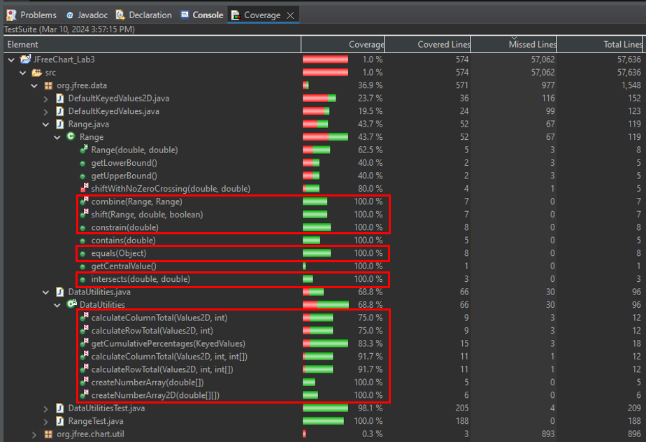

## Branch coverage

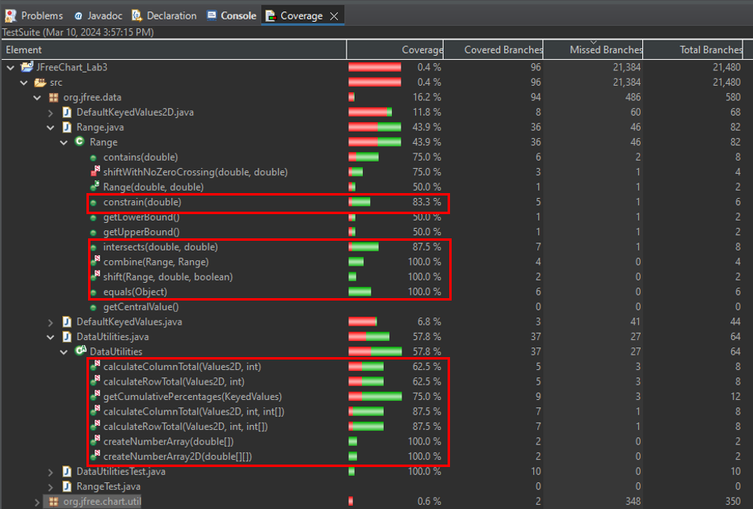

## Instruction coverage

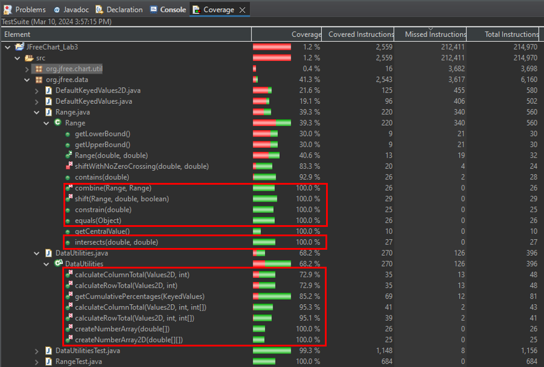

# 6 Pros and Cons of coverage tools used and Metrics you report

When considering the coverage tools, EclEmma, CodeCover were considered. It was observed that Jacoco was the under the
hood coverage tool used by EclEmma in Eclipse so it was not further investigated. The pros and cons between the tools
were as follows:\
EclEmma: The pros include accessiblity, as it was already part of Eclipse, especially as all team members are using and
are familiar with this IDE. This allowed for a smaller-learning curve for the team especially regarding integration.
Unfortunately, EclEmma does not have the exact match for the 3 methods proposed as it does not have statement or
condition coverage.

CodeCover: A pro is detailed condition coverage analysis, which is a significant advantage when striving for the
exact metrics specified. The interface and visualization of CodeCover are helpful for in-depth analysis, but the downside
is the integration challenges as some members had challenges with Eclipse plugin integration and the standalone setup.

Ultimately, the choice was to use EclEmma as it was easier for every member to participate in the lab. To handle the
discrepancies between the metrics in EclEmma and the proposed, we had to consider the differences.

Statement Coverage -> Line Coverage (used): measures the percentage of executable statements in the code that have been
executed. A similar but less granular metric provided by EclEmma was line coverage. This metric measures the proportion
of lines of code that have been executed during testing. Statement coverage has an advantage over line coverage in cases
when the language uses many short statements in a single line. In our case, this difference may not be significant.

Branch Coverage (used): measures the percentage of executed branches in the control flow of a program. This form of
coverage is more comprehensive than line or statement coverage, as it specifically focuses on ensuring that each
possible branch is executed during testing.

Condition Coverage -> Instruction Coverage (used): Condition coverage requires evaluating every possible boolean
sub-expression value. While this coverage is not in EclEmma, we used Instruction coverage which is a more granular
metric. It measures whether each individual instruction (or bytecode in the case of Java) has been executed. Doing so
may make up for some of the loss in detail by using Line over Statement coverage. While the lab instructions suggested
maybe using Method coverage, this was not seen as an informative metric as we are only evaluating the coverage of 10
methods and not the class as a whole.

# 7 A comparison on the advantages and disadvantages of requirements-based test generation and coverage-based test generation.

Requirement-based testing, a black-box testing method, involves the external specifications and requirements of the
software as seen in Assignment 2. In this approach, test cases are crafted based on user requirements and
specifications (seen in JavaDoc in our case). It focuses on what the software is expected to do and doesn't require
knowledge of the internal code structure. This can be seen as an advantage by reducing bias through separating the
technical aspects and the high-level purpose. This can also promote well-written documentation to ensure requirements
are clear. This also be show as a disadvantage as the effectiveness of this approach relies on the clarity and
completeness of the requirements. Requirment-based testing also runs the risk of missing unanticipated behaviors or
scenarios not outlined in the specifications. Additionally, it may overlook non-functional aspects like performance or
usability.

Coverage-based testing falls under the category of white-box testing, where the focus shifts to the internal workings of
the software through a more granular approach. This requires a thorough understanding of the code structure. Test cases
are designed to ensure that various parts of the codebase, such as lines, branches, and paths, are executed, with the
objective of uncovering hidden bugs and optimizing the code quality. The advantages include its evaluation on
quantitative measures of coverage which can aid in assessing the quality and performance of the code. It also can
provide insight into areas that require additional testing, leading to creation of new test cases. The disadvantages
include more technical knowledge required as there is more of a learning curve in assessing and interpreting the
numbers, metrics, and inner workings of the code. Another disadvantage is that the approach can be resource intensive by
trying to achieve high coverage numbers. This may also lead to neglecting of other important aspects like logical errors
that may be caught easier in a higher-level approach like black-box testing.

# 8 A discussion on how the team work/effort was divided and managed

The lab was split among the 5 members to even out the workload evenly. 3 members handled the creation of coverage tests,
while 2 handled the each manual test required in section 2. The lab report was split among all members.

Upon completion of the both types of tests, the tests were peer reviewed looking for defects or missing things.

# 9 Any difficulties encountered, challenges overcome, and lessons learned from performing the lab

Some of the initial difficulties in this lab involved setting up some of the coverage tools. Some required licenses
while some gave some members installation issues. As a result, we reverted to using EclEmma as our coverage tool. Once
the coverage tool was used, there was a bit of a learning curve in interpreting the coverage results and deciphering
where in the code needed additional testing. Additionally, what each metric meant and its underlying logic. This
challenge was overcome by reading documentation of each metric as well as understanding EclEmma better as the lab
progressed.

Another set of challenges we faced were meeting the coverage goals for some methods in DataUtilities. Upon the analysis
provided by EclEmma and inspection of the source code, it seems there is some unreachable code in calculateColumnTotal,
calculateRowTotal, and getCumulativePercentages. Below are screenshots and our interpretation of the code.

The second "for" loop in the below screenshot seems to be uncreachable because r2 is initialized to 0, and the condition
for the loop to execute is r2 > rowCount. Since rowCount is the number of rows in the object, it will never be less than
0 and the for loop will never execute.

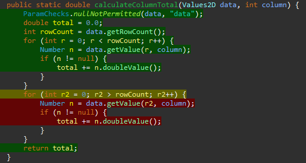

The first "if" statement in this method will never get triggered because the "total" variable is initialized to 0 right
above the statement. The "total" variable will never be greater than 0 when the highlighted "if" statement is checked.

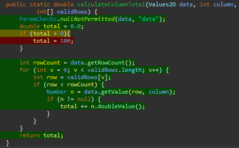

The above screenshots show code for calculateColumnTotal, but there are additional blocks of code in calculateRowTotal
that are unreachable in a similar fashion.

The highlighted "for" loop in the screenshot below is for getCumulativePercentages. This block of code will never
execute because i2 is initialized to 0. The condition for this block to get executed is i2 > data.getItemCount(). Since
data.getItemCount() represents the number of items in the data object, it will never be less than 0.

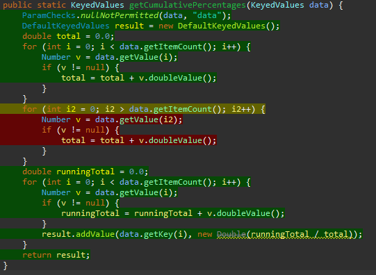

Some of the lessons learned this lab is that high coverage doesn't automatically imply high code quality, or that it is
free of defects such as logical issues. eg) Tests might cover a line of code but still not check for correct behavior or
edge cases. Additionally, the imporance of utilizing multiple metrics to get a more comprehensive view of the code. Some
metrics are quite high-level and may be as simple as checking if a method is run, while others can provide finer details
to complement the analysis.

This lab highlighted the strengths of coverage-based testing/white box, while also emphasizing the strengths of what
requirement-based testing/black box did well. In practice, combining these two approaches would offer a more robust
testing strategy by evaluating both the external functionality verification and internal code analysis.

# 10 Comments/feedback on the lab itself

Overall this lab was good exposure to white-box testing, especially after working directly with black-box testing. It
was nice to use the previous methods worked on before to allow more time to focus on the coverage tool rather than
test-creation. It was nice to have flexibility to use multiple tools, metrics etc.
